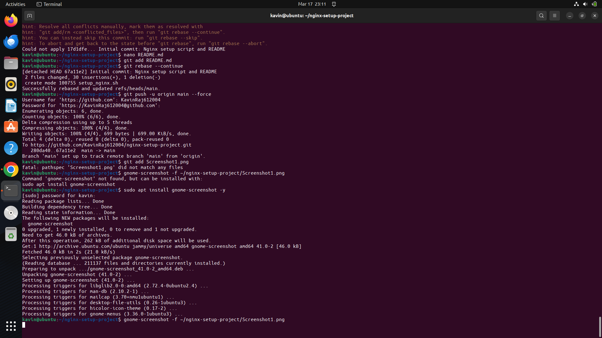

# Nginx Setup Project

This project contains a script to automatically install and configure Nginx on Ubuntu.

## Setup Instructions
1. Run `setup_nginx.sh` to install and configure Nginx.
2. Verify the setup with `curl http://localhost`.

## Screenshots

